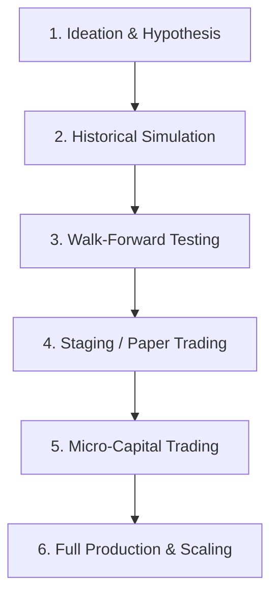

# The Path to a Profitable Trading Strategy

Building a consistently profitable trading strategy is not just about writing code; it is a systematic, multi-stage engineering lifecycle. Moving immediately from a backtest to full-size production trading is the most common reason bots lose money.

Follow this 6-stage framework to guide your custom strategy from initial hypothesis to live execution.

---

## The 6-Stage Strategy Lifecycle

### Stage 1: Ideation & Hypothesis
Every strategy must start with a falsifiable hypothesis about market behavior. If you cannot explain *why* your strategy should make money, it is likely fitting noise.
- **Inherent Market Edges:**
  - **Mean Reversion:** Asset prices tend to return to an average over time (e.g., trading indicators like RSI, Bollinger Bands, or spread arbitrage).
  - **Trend Following / Momentum:** Ride trends triggered by institutional flow or fundamental shifts (e.g. SMA crossovers, Breakouts).
  - **Statistical Arbitrage:** Trade correlations or price gaps between closely related assets.
  - **Liquidity Provision:** Capture the bid-ask spread by posting buy/sell orders (market making).
- **Action:** Write down your hypothesis (e.g., "Buying BTC when 1-minute RSI falls below 20 during macro-uptrends and exiting at a 3% gain or 1% loss yields a net profit over time").

### Stage 2: Historical Simulation (Backtesting)
Simulate your strategy using historical candlestick data to verify if your edge exists statistically.
- **Avoid Lookahead Bias:** Ensure orders trigger on the *next bar's open price*, never on the current bar's close price or high/low. You cannot buy at the low of a candle that has not completed.
- **Calculate Trading Metrics:**
  - **Profit Factor:** Gross Profits divided by Gross Losses. A profitable strategy should have a profit factor of **> 1.25** in backtesting.
  - **Win Rate vs Risk-Reward (R:R):** A 40% win rate can be highly profitable if your average win is 3x larger than your average loss.
  - **Max Drawdown:** The maximum peak-to-trough decline in equity. Ensure your max historical drawdown does not exceed your risk threshold.
  - **Sharpe Ratio:** Measures risk-adjusted return. Aim for an annualized Sharpe Ratio **> 1.5** in backtests.

### Stage 3: Walk-Forward Analysis (Out-of-Sample Validation)
Overfitting (or curve-fitting) happens when you optimize parameters (e.g., changing RSI lengths or SMA periods) until the strategy perfectly fits historical noise. This strategy will fail in live trading.
- **Methodology:**
  1. Split your historical data: 70% for **In-Sample (Training)** and 30% for **Out-of-Sample (Testing)**.
  2. Optimize your strategy parameters *only* on the In-Sample dataset.
  3. Run the backtest with those optimized parameters on the Out-of-Sample dataset.
  4. If the performance drops significantly on the Out-of-Sample dataset, your strategy is overfitted. Simplify the rules and try again.

### Stage 4: Paper Trading & Staging (Forward Testing)
Once backtests are positive, deploy the script to Hummingbot in **Paper Trading** mode or on testnets (e.g. Sepolia, Binance Testnet) for at least 1–2 weeks.
- **Goals:**
  - Verify that the API connections, websockets, and event loops function without raising unhandled Python exceptions.
  - Check for execution discrepancies: Is the bot receiving data at the same speed as the backtest? Are signals triggering on time?
  - Monitor memory usage and logs for rate-limiting warnings.

### Stage 5: Micro-Capital Deployment (Live Testing)
Transition to live trading, but only deploy a tiny amount of capital (e.g., $10 to $50) that you are entirely willing to lose.
- **Why this is critical:**
  - **Slippage:** In live markets, your limit orders might not get filled, or your market orders will get filled at worse prices than expected. Backtests rarely simulate live order book depth accurately.
  - **Fee Drag:** Exchanges charge maker and taker fees. Verify that fees do not consume all your margins.
  - **Latency:** In high-volatility events, network latency can delay order submissions and cancellations.
  - **Execution bugs:** Real execution states (e.g. partially filled orders, rejected orders, API timeouts) behave differently than simulated states.

### Stage 6: Full Production & Safe Scaling
Once you have 2–4 weeks of profitable micro-capital history and the live execution metrics align with your backtests, scale up capital incrementally. Never jump instantly to full sizing.

---

## Advanced Risk Management & Capital Allocation

Risk management is the boundary that separates professional trading systems from gambling. Even a strategy with a high win rate will eventually fail without rigorous risk bounds.

### 1. Optimal Position Sizing (Kelly Criterion)
The Kelly Criterion calculates the mathematically optimal fraction of capital to allocate to a single trade to maximize long-term logarithmic wealth, avoiding ruin:

$$f^* = \frac{bp - q}{b}$$

Where:
- $f^*$: The fraction of the trading account to allocate to the trade.
- $b$: The decimal odds received on the wager ($b = \text{Average Win} / \text{Average Loss}$, or Risk-to-Reward ratio).
- $p$: The probability of winning (Win Rate).
- $q$: The probability of losing ($1 - p$).

*Practical Hint (Half-Kelly):* Because real trading parameters are estimated and fluctuate, institutions and professional system designers typically trade a **Half-Kelly** (allocating only $f^* / 2$) to buffer against variance and prevent large drawdowns.

### 2. Value at Risk (VaR) & Expected Shortfall (CVaR)
- **Value at Risk (VaR):** The maximum expected loss over a specific time horizon (e.g., 1 day) at a given confidence level (e.g., 95% or 99%). For example, a daily 95% VaR of $500 means there is only a 5% chance the strategy will lose more than $500 in a single day.
- **Expected Shortfall (Conditional VaR):** Measures the average loss *in the worst-case tail* (the 5% worst days). It answers the question: "If the market breaches our VaR threshold, how bad is the average loss going to be?"
- **Action:** Code daily volatility calculations into your strategy. If market volatility spikes, automatically reduce order sizes to keep VaR constant.

### 3. Drawdown Limits & Hard Circuit Breakers
Always implement structural circuit breakers directly in code:
- **Maximum Daily Loss Limit:** If the portfolio loses a set percentage (e.g., 2% of total equity) within a rolling 24-hour window, the bot cancels all open orders, closes active positions, and halts execution for 24 hours.
- **Maximum Historical Drawdown Hysteresis:** If the bot's drawdown exceeds the maximum drawdown observed in the out-of-sample backtest by more than 1.5x, halt the bot. The edge has likely degraded or market dynamics have changed.

### 4. Correlation & Diversification
Running multiple bots on highly correlated assets (e.g. market making ETH-USDT and BTC-USDT simultaneously) does not diversify risk. In market crashes, both pairs will correlate to 1.0, leading to doubled losses.
- Track correlation matrices of assets you trade.
- Run complementary strategies (e.g., one trend-following strategy and one mean-reverting strategy) to smooth out the collective equity curve.

---

## Building Competitive Alpha: Retail vs. Institutional

As a retail trader or automated agent, you cannot compete directly with billion-dollar HFT firms in speed-based arbitrage or order book queue dominance. Instead, build competitive alpha by focusing where institutions cannot play:

### 1. Focus on Long-Tail/Exotic Niches
Institutional funds require huge liquidity to move capital. They cannot trade illiquid pairs or low-cap altcoins because their trade sizes would cause massive market impact.
- **Alpha Space:** Deploy market-making or mean-reversion bots on newly launched DeFi liquidity pools, long-tail altcoins, or secondary exchanges. These markets contain significant execution inefficiencies (spreads of 1% to 5%) that are highly profitable for small-to-medium capital sizes.

### 2. Microstructure Alpha (Beyond Simple Indicators)
Lagging indicators (like RSI, MACD, or Moving Averages) are derived from past close prices and are heavily saturated. Focus instead on real-time market microstructure:
- **Order Book Imbalance (OBI):** Analyze the depth of bids vs asks. A massive imbalance on the buy side suggests imminent upward price pressure.
- **Cumulative Volume Delta (CVD):** Tracks the net difference between buying and selling market orders. An rising CVD during a flat price trend indicates aggressive buyers are absorbing selling pressure, signaling a breakout.
- **Liquidity Gaps:** Identify structural voids in the order book where price can move rapidly due to a lack of liquidity.

### 3. Alternative Data & Cross-Market Signals
Look for correlation edges that occur across markets:
- **Funding Rate Arbitrage:** Buy spot assets and short the perp contract when funding rates are extremely high, capturing the funding yield risk-free.
- **Gas Fee / Blockchain Congestion Analysis:** Track onchain activity to predict sudden spikes in DEX transaction speed requirements or token flow.
